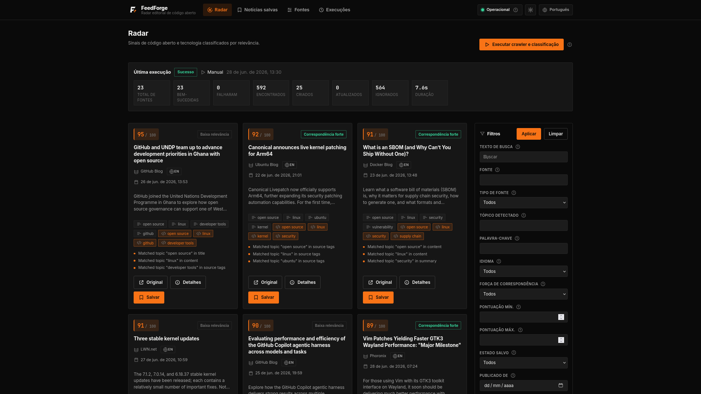

<div align="center">


# FeedForge

**A local-first editorial radar that ranks open source &amp; tech news with transparent, deterministic scoring — no LLMs, no noise.**

[](https://github.com/kristyancarvalho/feedforge/releases)
[](https://nodejs.org)
[](https://www.typescriptlang.org)
[](https://react.dev)
[](https://fastify.dev)
[](https://www.prisma.io)
[](https://docs.docker.com/compose/)
[](https://vitest.dev)

</div>

<p align="center">
  
</p>

## What FeedForge Is

FeedForge answers a single question: which recent open source and technology news are most relevant for my technical blog or editorial interests?

It collects news from sources you declare, normalizes and deduplicates them, classifies them with transparent scoring, and exposes the results in a dense, dark, technical dashboard where you can inspect, save, and organize interesting items.

It is not a generic RSS reader, an AI writing assistant, or a social media trend tracker. It is a focused editorial radar.

## Why FeedForge Exists

Following open source news across dozens of feeds is noisy. FeedForge filters that noise against an explicit editorial profile so the signal you care about — Linux, security, developer tools, infrastructure, self-hosting, programming languages — rises to the top, with a clear explanation of why each item ranked where it did.

## What's New in 1.1.1

- Radar now uses a two-column layout with the filters in a sticky side panel, giving the news grid more horizontal room. The panel collapses above the grid on small screens.
- The filter search field is the primary control, with a clearer label, a search icon, and a stronger orange focus ring.
- Translated contextual help indicators were added to the filter controls.
- The "Open original" action uses a compact `Original` label with a full accessible name and no longer wraps onto two lines.
- Icons inside the orange primary buttons now use a high-contrast color.
- The header status tooltip opens downward so it is no longer clipped by the top bar.
- The score breakdown renders filled progress bars proportional to each score, with the negative penalty shown in a distinct danger color.
- Source reliability fixes: Viva o Linux now points to its working `https://www.vivaolinux.com.br/index.rdf` feed, and 9to5Linux is disabled by default because its server-side feed is blocked by a Cloudflare anti-bot challenge that cannot be fetched without browser automation (out of scope). Re-enable it in `sources.json` if you have a working access path.

## What's New in 1.1.0

- Refreshed orange/black visual identity with a dedicated FeedForge logo.
- Light and dark themes with a persisted toggle.
- Bilingual interface in English and Brazilian Portuguese with a language toggle.
- Responsive news grid with cursor-based infinite scroll.
- Operational status indicator in the header (database, crawler, sources, cron).
- Stricter, more explainable classification with technical-depth and open-source-relevance signals and `strong`/`good`/`weak`/`low` match-strength labels.
- Advanced news filters (match strength, score range, source type, keyword, date range, summary/reasons/penalty presence, and more).
- Expanded default Portuguese and English open source sources.
- Contextual help tooltips and an enriched icon set.
- Broader backend and frontend test coverage.

## Features

- Source declaration through a single `sources.json` file.
- Portuguese (`pt-BR`) and English (`en`) source support.
- RSS/Atom-first ingestion.
- Explicit HTML scraping for sources without a usable feed.
- Text, URL, and date normalization.
- Deduplication across repeated crawls.
- Deterministic classification and scoring with a full score breakdown and match-strength labels.
- Saved news workflow with editorial statuses and notes.
- Cron-based automatic crawling and classification.
- Manual "Run crawler and classification" action from the SPA.
- Radar dashboard, news detail, saved news, source health, and run history pages.
- Responsive news grid with infinite scroll, advanced filters, light/dark themes, and a bilingual (`en` / `pt-BR`) interface.
- REST API with structured errors.
- Test coverage for the core backend and frontend logic.
- Docker Compose orchestration.

## Open Source Focus

Default sources are focused on open source, Linux, software security, developer tools, GitHub, programming languages, infrastructure, self-hosting, privacy, and both Brazilian and international open source communities. Sources that require login, paid APIs, or that are mostly generic business, finance, crypto speculation, celebrity, or gaming news are intentionally excluded.

## Why There Are No LLMs

FeedForge intentionally avoids LLMs. The goal is not to generate posts or invent summaries, but to provide a transparent and deterministic signal ranking system. Every score is explainable through topics, keywords, source weight, freshness, novelty, and negative-topic penalties.

The same input always produces the same score, and the UI shows the exact reasons behind every classification.

## Supported Source Languages

Only two source languages are allowed:

```txt
pt-BR
en
```

The default seeded `sources.json` never includes sources in other languages.

## RSS-First Approach

RSS/Atom is preferred whenever a source provides a usable feed. Use the `rss` source type for those.

HTML scraping is used only when:

- the source does not provide a usable RSS/Atom feed;
- the source is explicitly configured with the `html` type;
- CSS selectors are provided in `sources.json`.

FeedForge does not follow links recursively, does not crawl arbitrary pages, does not handle robots.txt in this version, and does not scrape sources that require login.

## Running With Docker

FeedForge runs entirely through Docker Compose. Node.js, npm, Prisma, Vite, and Vitest never need to be installed on the host.

Start the full application (app + PostgreSQL):

```bash
docker compose up --build
```

Then open:

```txt
http://localhost:3000
```

The `app` container installs dependencies, generates the Prisma client, applies the database schema, builds the SPA, and starts the backend, which also serves the built frontend. PostgreSQL uses a persistent named volume.

Common Docker Compose commands:

```bash
docker compose up --build
docker compose run --rm app npm test
docker compose run --rm app npm run build
docker compose run --rm app npx prisma generate
docker compose run --rm app npx prisma migrate deploy
docker compose down
```

Do not run `npm`, `node`, `npx`, or `prisma` directly on the host. Every command runs inside Docker.

## Environment Configuration

Copy `.env.example` to `.env` and adjust if needed:

```env
DATABASE_URL="postgresql://feedforge:feedforge@db:5432/feedforge"

APP_PORT=3000
NODE_ENV=development

SOURCES_FILE=./sources.json

CRAWLER_USER_AGENT="FeedForgeBot/0.1"
CRAWLER_TIMEOUT_MS=15000
CRAWLER_MAX_CONCURRENT=3

CRON_ENABLED=true
CRON_SCHEDULE="0 */3 * * *"

PUBLIC_APP_NAME="FeedForge"
```

All environment values are validated at startup. Invalid values fail fast with a clear error; missing optional values use safe defaults.

## Configuring Sources

Sources are declared in `sources.json`, which contains an `editorialProfile` and a `sources` array. The file is validated with Zod at startup and whenever you reload sources. Invalid configuration produces a clear error and is never silently ignored.

### Editorial Profile

The editorial profile defines the topics that matter and the topics that should reduce a score.

```json
{
  "editorialProfile": {
    "name": "FeedForge Open Source Radar",
    "language": ["pt-BR", "en"],
    "topics": [
      "open source",
      "software livre",
      "linux",
      "arch linux",
      "kernel",
      "security",
      "developer tools",
      "github",
      "docker",
      "kubernetes",
      "typescript",
      "rust",
      "self-hosting",
      "privacy",
      "devops"
    ],
    "negativeTopics": [
      "celebrity",
      "sports",
      "crypto price speculation",
      "generic startup funding",
      "generic business news",
      "ai hype without open source relevance",
      "press release without technical content"
    ]
  }
}
```

### RSS Source

```json
{
  "id": "github-blog",
  "name": "GitHub Blog",
  "type": "rss",
  "url": "https://github.blog/feed/",
  "language": "en",
  "tags": ["github", "developer tools", "open source"],
  "weight": 1.1,
  "enabled": true
}
```

### HTML Source

HTML sources require `selectors.item`, `selectors.title`, and `selectors.link`. The `summary`, `date`, and `author` selectors are optional. Relative links are resolved against the source URL. If the required selectors match nothing, the source is recorded as failed and the rest of the run continues.

```json
{
  "id": "example-html",
  "name": "Example HTML Source",
  "type": "html",
  "url": "https://example.com/news",
  "language": "en",
  "tags": ["open source"],
  "weight": 1.0,
  "enabled": false,
  "selectors": {
    "item": "article",
    "title": "h2",
    "link": "a",
    "summary": "p",
    "date": "time",
    "author": ".author"
  }
}
```

After editing `sources.json`, reload sources from the Sources page or with:

```bash
curl -X POST http://localhost:3000/api/sources/reload
```

## How Classification Works

Classification is deterministic and explainable. Each news item is normalized and scored against the editorial profile, source tags, an open source keyword list, technical-depth signals, and open-source-relevance signals. The result includes detected topics, matched keywords, a score breakdown, a match-strength label, and human-readable reasons.

The final score is a weighted combination, clamped from 0 to 100:

```txt
finalScore =
  topicScore * 0.30 +
  keywordScore * 0.20 +
  technicalDepthScore * 0.15 +
  openSourceRelevanceScore * 0.15 +
  sourceScore * 0.08 +
  freshnessScore * 0.07 +
  noveltyScore * 0.05 -
  negativePenalty
```

All partial scores are normalized from 0 to 100, weighting title over tags over summary over body:

- `topicScore`: editorial topic matches, with source tags considered.
- `keywordScore`: open source keyword matches, with strong weight for title matches and a boost from source tags.
- `technicalDepthScore`: signals that an item carries real technical substance rather than surface coverage.
- `openSourceRelevanceScore`: signals that an item is specifically about open source rather than generic technology.
- `sourceScore`: derived from source weight (`1.0 -> 70`, `1.1 -> 80`, `1.2 -> 90`, `>= 1.3 -> 100`).
- `freshnessScore`: today `100`, last 3 days `85`, last 7 days `70`, last 30 days `40`, older `15`, unknown date `25`.
- `noveltyScore`: reduced when many similar recent items already exist, keeping the radar from being dominated by repeats.
- `negativePenalty`: subtracted (weighted) when an item matches the negative topics.

The final score maps to a match-strength label shown across the UI:

```txt
strong   score >= 80
good     score >= 65
weak     score >= 45
low      score <  45
```

Every item stores reasons such as:

```txt
Matched topic "linux" in title
Matched keyword "security" in summary
Recent item published in the last 24 hours
Reduced score due to negative topic "generic startup funding"
```

## How Saved News Works

Any item can be saved from the Radar, News Detail, or Saved News pages. Saving is idempotent. Saved items move through editorial statuses:

```txt
saved
idea
researching
drafting
published
ignored
```

You can edit notes per item and filter saved news by status, source, topic, language, match strength, and minimum score. Unsaving removes the saved record.

## How Cron Works

Scheduled crawling is handled by `node-cron`:

- Controlled by `CRON_ENABLED`.
- Uses `CRON_SCHEDULE` (default `0 */3 * * *`, every three hours).
- Runs the exact same pipeline as the manual button.
- Creates a `CrawlerRun` with trigger `cron`.
- Skips the cycle if a run is already active and records the skip.
- Logs start, end, skip, and failure events.

Example schedules:

```txt
0 */3 * * *    every three hours
0 * * * *      every hour
0 7 * * *      every day at 07:00
```

## How Manual Crawling Works

The Radar page has a prominent "Run crawler and classification" button that calls `POST /api/crawler/run`. It runs the full pipeline — reload sources, crawl, normalize, deduplicate, persist, classify, and summarize the run.

Concurrent runs are prevented. If a run is already active, the API returns a structured `CRAWLER_ALREADY_RUNNING` error and the button reflects the active state. When the run finishes, the latest run summary is shown.

You can also trigger a run from the CLI inside Docker:

```bash
docker compose run --rm app npm run crawler:run
```

## API Overview

All endpoints are served under `/api` and return structured errors of the form `{ "error": { "code", "message", "details" } }`.

```txt
GET    /api/health
GET    /api/sources
POST   /api/sources/reload
GET    /api/news
GET    /api/news/:id
POST   /api/news/:id/save
DELETE /api/news/:id/save
PATCH  /api/news/:id/status
GET    /api/runs
GET    /api/runs/latest
POST   /api/crawler/run
```

The news list is cursor-paginated. It returns `{ items, nextCursor, hasMore, total }` and supports `cursor` and `limit` (default `24`, max `60`) together with the filters `q`, `source`, `sourceType`, `topic`, `keyword`, `language`, `status`, `saved`, `minScore`, `maxScore`, `matchStrength`, `publishedFrom`, `publishedTo`, `runId`, `hasSummary`, `hasReasons`, `hasNegativePenalty`, and `sort`. Results are sorted by final score then published date by default. The runs list uses classic `page`/`limit` pagination.

## Running Tests

Tests are written with Vitest and never depend on live external websites; all parsing is exercised with inline fixtures. Run them inside Docker:

```bash
docker compose run --rm app npm test
```

Backend tests cover environment validation, source schema validation, RSS and HTML parsing, text and URL normalization, fingerprint generation, deduplication, topic and keyword matching, source/freshness/novelty scoring, technical-depth and open-source-relevance scoring, negative penalty, final score calculation, match-strength labels, classification reasons, news and run filter parsing, status service, run status calculation, and saved status validation. Frontend tests cover query-parameter parsing, filter formatting, source-health levels, match-strength bands, the API query builder and error type, and internationalization (language inference, translation fallback, and English/Portuguese dictionary parity).

## Troubleshooting

- App not reachable at `http://localhost:3000`: confirm the `app` container is healthy with `docker compose ps` and check logs with `docker compose logs -f app`.
- Database errors at startup: confirm the `db` container is healthy and that `DATABASE_URL` matches the compose service (`db:5432`). The app waits for the database health check before starting.
- `sources.json` rejected: the error message names the failing field. Fix the file and reload sources from the Sources page or `POST /api/sources/reload`.
- A source shows a last error: open the Sources page to inspect the message. RSS feeds occasionally fail transiently; the run continues for all other sources and reports partial success.
- No news after a run: ensure at least one source is `enabled`, then use the Radar "Run crawler and classification" button and review the latest run summary and the Runs page.
- Reset the database volume: `docker compose down -v` removes the persistent PostgreSQL volume and starts fresh on the next `docker compose up --build`.

## Project Philosophy

FeedForge should remain boring in the best way. It collects, classifies, and organizes open source news reliably. Every score is explainable, every source is explicit, and every command is reproducible through Docker. It is meant to be useful for real technical writing, not just a demo.
